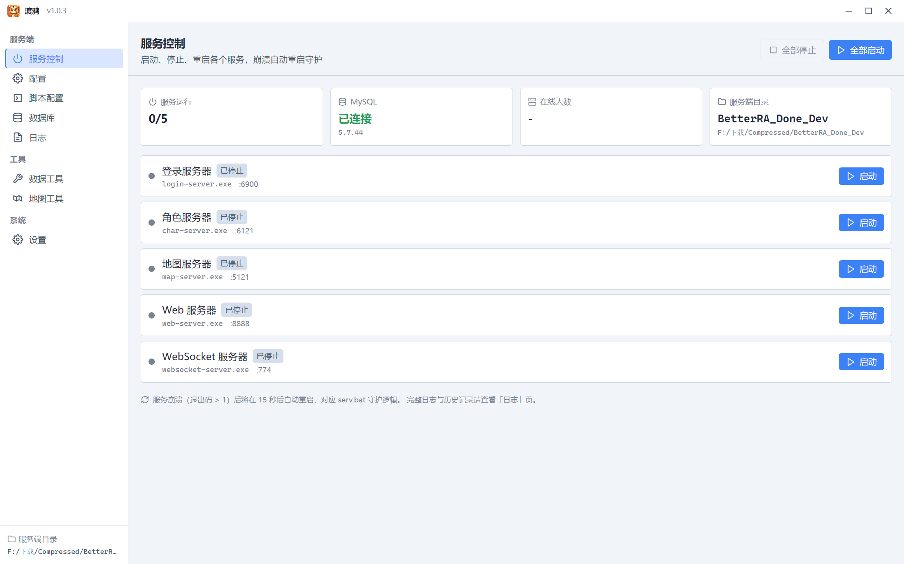
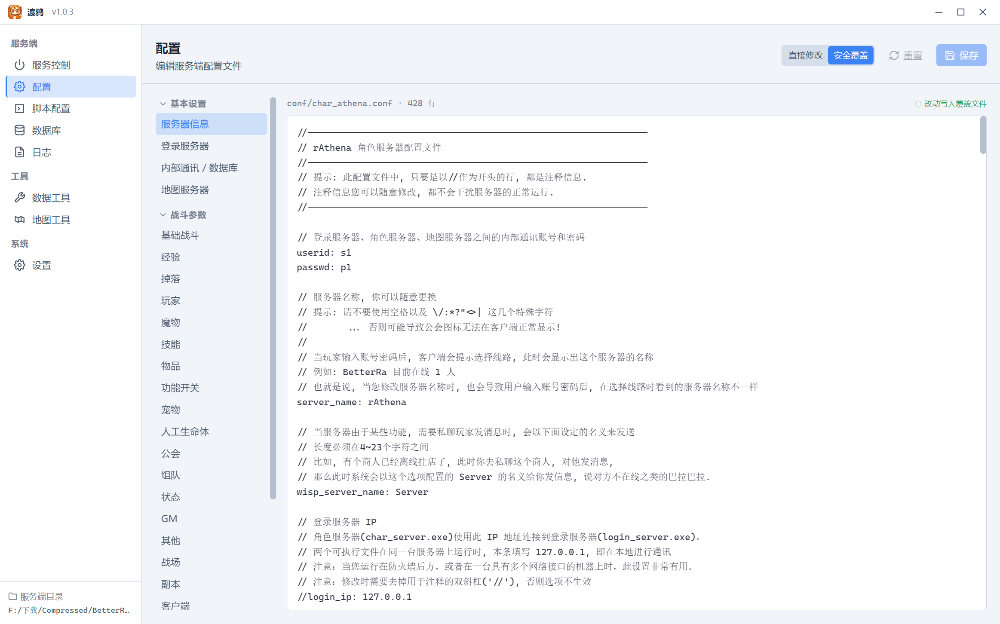
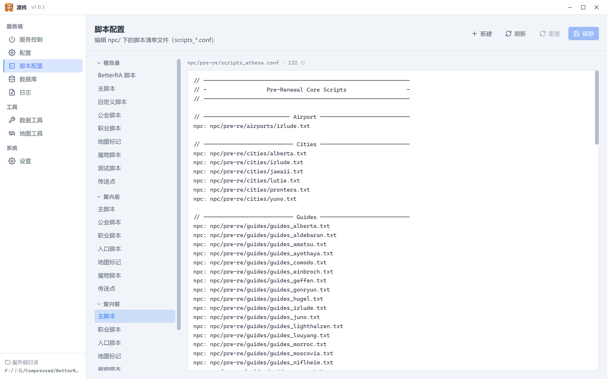
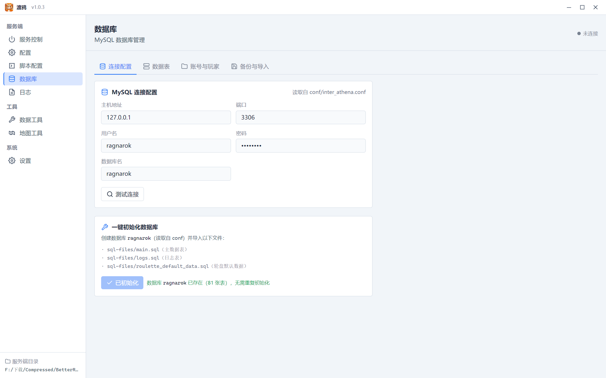
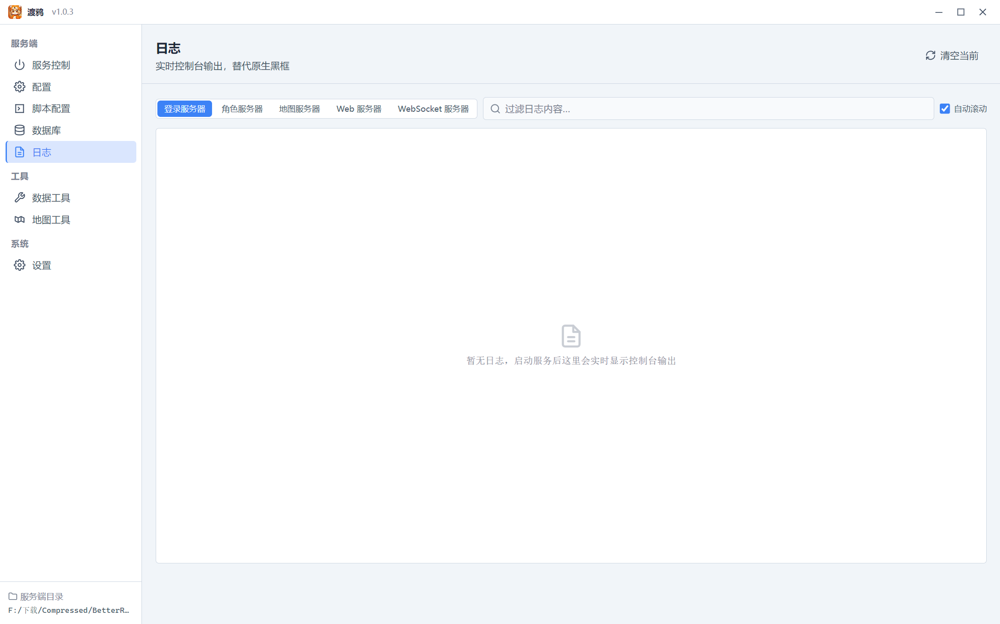
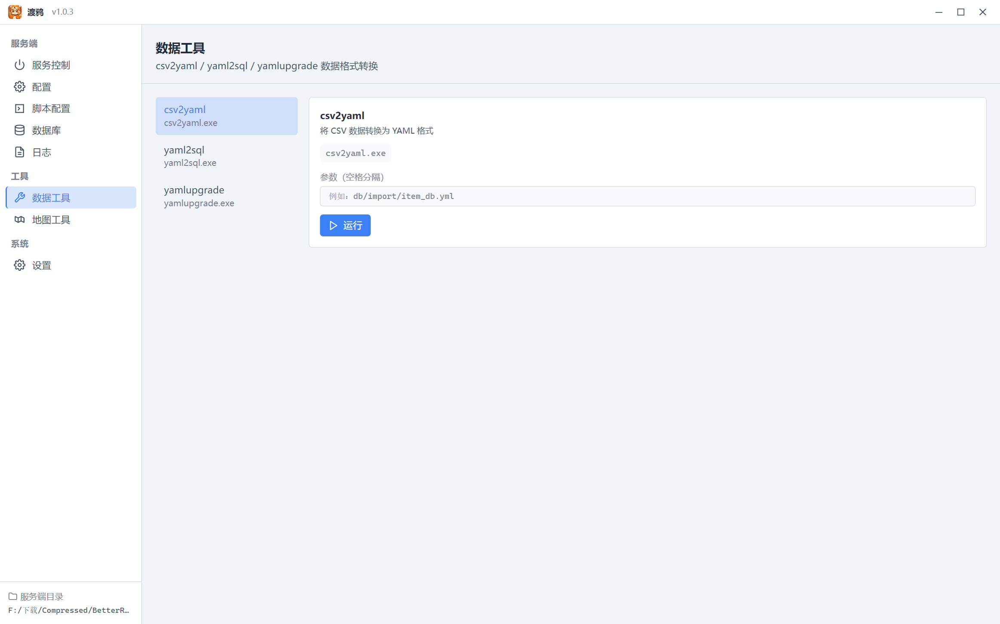
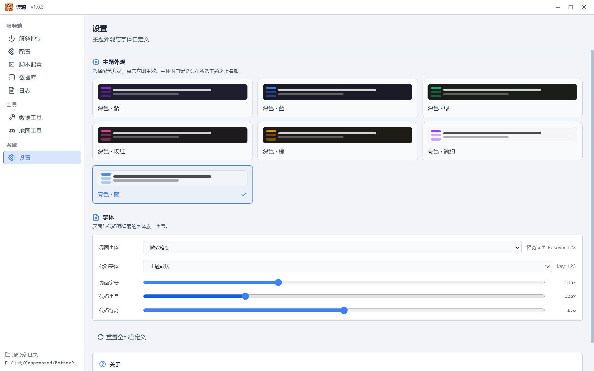
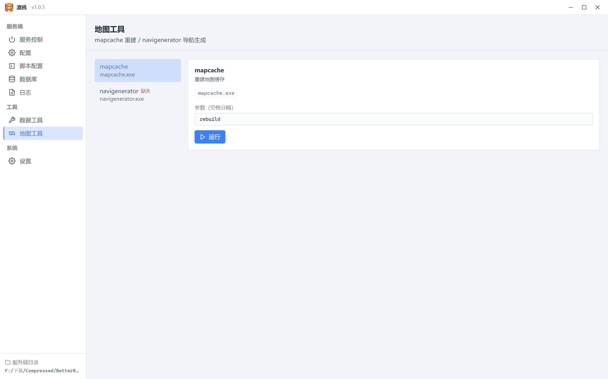

<div align="center">

# 🦊 渡鸦 Raven

**RO（BetterRA / rAthena）服务端启动器与可视化管理桌面端**

一个为 BetterRA / rAthena 服务端量身打造的桌面管理工具：进程托管、配置编辑、数据库管理、日志聚合、工具集成一站式搞定。深色紫调界面，原生 Windows 体验。

[](./apps/launcher/package.json)
[](https://www.electronjs.org/)
[](https://react.dev/)
[](#许可证)

</div>

---

## 📖 项目简介

**渡鸦（Raven）** 是一款 Electron 桌面应用，专为管理 BetterRA / rAthena（基于 rAthena 的 RO 服务端）而设计。它解决了传统手工运维服务端的痛点：

- 🖥️ 双击 `.bat` 启动 5 个黑框进程、出错只能盯日志猜
- 📝 改一行配置要在 20+ 个 `battle/*.conf` 里翻找，改完没备份心慌
- 🗄️ 数据库初始化要手动执行一堆 `.sql`，账号注册得敲 SQL
- 📋 日志散落在 5 个 `log/*.log`，定位问题像大海捞针

渡鸦把这些全部收编到一个窗口里，让开服、调参、维护像玩现代游戏面板一样轻松。

### 🖼️ 界面一览

<p align="center">
  
</p>
<sub><b>↑ 服务控制首页</b> —— 五大服务进程实时状态、端口、MySQL 健康度、在线人数一目了然</sub>

| | |
|:---:|:---:|
|  |  |
| **配置编辑**（直接修改 / 安全覆盖双模式） | **脚本配置**（中文标签 + 智能分组） |
|  |  |
| **数据库管理**（连接 / 表 / 账号 / 备份） | **日志聚合**（彩色分级 + 筛选） |
|  |  |
| **数据 / 地图工具** | **设置**（主题 / 版本信息） |

---

## ✨ 主要功能

应用左侧导航分四大组：**服务端 / 工具 / 系统**（远程组保留代码，UI 暂时隐藏）。下面逐个介绍。

### 🎛️ 1. 服务控制（首页）

<p align="center">
  
</p>

一站式管理 5 个核心服务进程：

| 服务 | 可执行文件 | 默认端口 | 职责 |
|------|-----------|---------|------|
| 登录服务器 | `login-server.exe` | 6900 | 账号认证 |
| 角色服务器 | `char-server.exe` | 6121 | 角色数据 |
| 地图服务器 | `map-server.exe` | 5121 | 游戏主逻辑 |
| Web 服务器 | `web-server.exe` | 8888 | Web API / 商城 |
| WebSocket 服务器 | `websocket-server.exe` | 5000 | 网页客户端通讯 |

**特性：**
- 🟢 **进程托管**：在应用内启动 / 停止 / 重启任一服务，崩溃自动重启（supervise 模式）
- 📊 **实时状态**：每个服务的运行状态（已停止 / 启动中 / 运行中 / 停止中 / 已崩溃）、PID、CPU、内存、累计重启次数一目了然
- 🚀 **一键全启 / 全停**：顺序启动全部服务，或一键停止全部
- 🔌 **端口动态读取**：直接从各 `*_athena.conf`（含 import 覆盖）解析实际监听端口，不再硬编码
- 💚 **健康面板**：MySQL 连通性 + 服务端版本 + 当前在线人数（每 30 秒刷新）
- 🛑 **关闭保护**：点 X 关窗口时弹确认对话框，避免误关导致服务中断

### 📝 2. 配置编辑（Config）

<p align="center">
  
</p>

最强力的功能 —— 可视化编辑 `conf/` 下所有配置文件，**双模式切换**：

#### 模式 A：直接修改（默认）
直接读写原文件（如 `conf/login_athena.conf`），保存前自动备份到 `conf/.backup/`。

#### 模式 B：安全覆盖 ✨
rAthena 官方推荐的分层配置 —— 原文件保持不动，所有改动写到 `conf/import/` 下的覆盖文件。升级服务端时原文件被覆盖，你的配置仍完好无损。

**安全覆盖的工作方式：**
- 📖 **读取时合并**：把「原文件 + import 覆盖文件」合并后显示「最终生效值」
- 💾 **保存时只写 diff**：自动对比原文件，**只把改过的行**写入 import 文件，保持覆盖文件干净
- 🗂️ **battle_conf.txt 分区**：19 个 `battle/*.conf` 共用一个 `battle_conf.txt`，用 `// battle/exp.conf` 注释行作为分区标记，互不干扰

**conf → import 映射规则：**

| 原文件 | import 目标 |
|--------|------------|
| `conf/login_athena.conf` | `conf/import/login_conf.txt` |
| `conf/char_athena.conf` | `conf/import/char_conf.txt` |
| `conf/map_athena.conf` | `conf/import/map_conf.txt` |
| `conf/inter_athena.conf` | `conf/import/inter_conf.txt` |
| `conf/battle/*.conf` | `conf/import/battle_conf.txt`（全部聚合，按文件分区）|
| `conf/groups.yml` | `conf/import/groups.yml` |
| `conf/atcommands.yml` | `conf/import/atcommands.yml` |
| `conf/maps_athena.conf` | ❌ 不支持（无对应 import 文件，开关自动禁用）|

**配置分类（左侧可折叠导航）：**
- **基本设置**：服务器信息、登录 / 内部通讯 / 地图服务器
- **战斗参数**：19 个 battle 分类（经验 / 掉落 / 玩家 / 魔物 / 技能 / 物品 / GM ...）
- **地图列表**：地图清单
- **GM 权限**：GM 设置、玩家组（yml）

**内置编辑器**：左侧分类导航 + 右侧 `CodeEditor` 纯文本编辑器，支持搜索、撤销、Tab 缩进。

### 📜 3. 脚本配置（NpcScripts）

<p align="center">
  
</p>

管理 `npc/` 下的脚本清单文件（`scripts_*.conf`，决定哪些 NPC 脚本被加载）。

**特性：**
- 📁 **动态文件列表**：扫描 `npc/` 目录下所有 `.conf` 文件
- 🏷️ **中文标签**：原始 `scripts_athena.conf` → 显示「主脚本」，`scripts_warps.conf` → 「传送点」，更直观
- 📊 **智能分组**：
  - **根目录**：标准入口脚本
  - **复兴前 / 复兴后**：根据 `pre-re` / `re` 子目录归类
  - **自定义**：所有非标准文件自动归类到此
- ➕ **新建 conf**：一键创建新的脚本清单文件，写到 `npc/custom_scripts/` 下
- 🔒 **无安全覆盖**：脚本清单没有 import 机制，统一走直接修改

### 🗄️ 4. 数据库管理（Database）

<p align="center">
  
</p>

完整的 MySQL 数据库管理面板，4 个 Tab：

#### 🔗 连接
- 自动从 `inter_athena.conf`（含 import 覆盖）读取数据库配置
- 测试连接 / 一键初始化（自动创建库 + 导入全部 `.sql`）
- 🛡️ **防误触**：若库已存在且含表，初始化按钮自动禁用
- 🔁 **跨页保持**：连接状态记在 zustand store，切到别的页面再回来不用重连

#### 📋 数据表
- 列出所有表 + 行数
- 分页浏览表数据、关键字搜索

#### 👤 账号
- 账号列表、创建账号（账号 / 密码 / 性别 / 邮箱）
- 修改组（GM 等级）、改密码、封禁 / 解封、删除账号
- 查看账号下的角色、改 Zeny、删角色

#### 💾 备份
- 全库备份（`mysqldump`）到指定目录
- 日志表单独备份（可配置定时计划）

### 📋 5. 日志（Logs）

<p align="center">
  
</p>

聚合所有服务的实时日志到一处：

- 🎨 **彩色分级**：`[Status]` 绿 / `[Error]` 红 / `[Notice]` 蓝 / `[SQL]` 紫 / `[CLI]` 青 等
- 🔍 **按服务筛选**：login / char / map / web / websocket 切换
- 🔤 **关键字搜索**：实时过滤
- 🧹 **一键清空**：清掉当前日志缓存

### 🔧 6. 工具（Tools）

<p align="center">
  
  &nbsp;
  
</p>

直接调用服务端自带工具，不用敲命令行：

#### 数据工具
- `csv2yaml.exe`：CSV → YAML 转换
- `yaml2sql.exe`：YAML → SQL 转换
- `yamlupgrade.exe`：YAML 格式升级

#### 地图工具
- `mapcache.exe`：重建地图缓存
- `navigenerator.exe`：生成寻路导航数据

运行时实时显示 stdout/stderr，退出码一目了然。

### ⚙️ 7. 设置（Settings）

<p align="center">
  
</p>

- 🎨 **主题**：深色 / 浅色 / 跟随系统
- 📁 **服务端目录**：重新选择 BetterRA 根目录
- ℹ️ **关于**：版本号（动态从 `app.getVersion()` 读取）、仓库地址

---

## 🏗️ 技术架构

### Monorepo 结构

```
rosever/
├─ apps/
│  ├─ launcher/              # 🚀 主应用（Electron + React + TS + Tailwind）
│  │  ├─ electron/
│  │  │  ├─ main.ts          # 主进程：IPC、BrowserWindow、进程管理
│  │  │  └─ preload.ts       # 预加载：contextBridge 暴露 window.rosever API
│  │  ├─ src/
│  │  │  ├─ pages/           # 7 个页面 + db/ 4 个子 Tab
│  │  │  ├─ components/      # TitleBar / SideNav / CodeEditor / ...
│  │  │  ├─ store/           # zustand stores（appStore / serviceStore / dbStore）
│  │  │  └─ themes.ts        # 主题配置
│  │  ├─ build/icon.ico      # 应用图标（6 尺寸）
│  │  └─ electron.vite.config.ts
│  └─ agent/                 # 📡 远程 Agent（可选，常驻守护进程）
│     └─ src/main.ts
└─ packages/
   └─ shared/                # 📦 共享代码（launcher 与 agent 复用）
      └─ src/
         ├─ types.ts         # 类型 + 常量（SERVICES / CONF_SECTIONS / toImportPath ...）
         ├─ protocol.ts      # WebSocket RPC 协议
         └─ services/
            ├─ processManager.ts  # 进程托管、日志解析、自动重启
            ├─ confStore.ts       # conf 读写、import 覆盖、battle 分区
            ├─ confParser.ts      # conf 解析为结构化 ConfItem[]
            ├─ dbManager.ts       # MySQL 连接 / 表 / 账号 / 备份
            └─ toolRunner.ts      # 工具进程执行
```

### 技术栈

| 层 | 技术 |
|----|------|
| 桌面框架 | **Electron 31** + electron-vite |
| 渲染层 | **React 18** + React Router 6 + TypeScript 5 |
| 样式 | **Tailwind CSS 3**（深色紫调主题） |
| 状态 | **Zustand 4**（跨页面状态、持久化） |
| 数据库 | **mysql2**（直连 MySQL） |
| 编码 | **iconv-lite**（处理 GBK/cp936 的 conf 文件） |
| 通讯 | **ws**（远程 Agent 模式） |
| 打包 | **electron-builder**（Windows portable exe） |

### 关键技术点

#### 🔤 GBK 编码处理
BetterRA 的 conf 文件普遍用 GBK/cp936 编码（含中文注释、服务器名）。所有读写都经过 iconv-lite 编解码，编辑器里看到的是 UTF-8，落盘时转回 GBK，确保 rAthena 能正确读取。

#### 🧬 进程管理（processManager）
- 用 `child_process.spawn` 托管 5 个服务进程
- 监听 stdout/stderr，按行解析 `[Status]/[Error]/[SQL]` 标记，自动分级染色
- 崩溃检测 + supervise 自动重启
- 状态变化通过事件推送到渲染层

#### 🛡️ 安全覆盖机制（confStore）
rAthena 的 import/ 分层配置是该项目的核心创新：

```
读取流程：
  原文件（login_athena.conf）
        ↓ 读
  + import 覆盖（import/login_conf.txt，优先级更高）
        ↓ 合并同名 key
  → 用户看到的「最终生效值」

保存流程：
  用户编辑后的文本
        ↓ 与原文件逐行 diff
  → 只把「值不同的行」写入 import 文件
  → 原文件零改动
```

**battle_conf.txt 的多文件聚合**是难点：19 个 battle 配置文件共用一个 `battle_conf.txt`，用注释行作为分区标记：

```
// battle/exp.conf          ← 分区头
base_exp_rate: 200          ← exp.conf 的覆盖项
job_exp_rate: 200
// battle/drops.conf        ← 另一个分区头
item_rate_common: 200       ← drops.conf 的覆盖项
```

读取时按分区提取对应段落；保存时只替换该分区，其他文件的覆盖项保持不动。

#### 🌐 远程模式（保留）
架构预留了远程管理模式：在本机运行的 `agent` 进程通过 WebSocket 连接到服务器上的 Agent，复用同一套 RPC 协议远程管理服务端。代码完整保留，仅 UI 入口暂时隐藏。

**RPC 协议特点：**
- `{ type:'rpc', id, method, args }` 通用 RPC 壳，支持并发
- `method` 字段直接复用 launcher IPC channel 名（`service:start` / `db:listAccounts` ...），Agent 端路由极薄
- Token 认证握手 + 服务端状态推送（`status` / `log`）

#### 🚫 ws 可选依赖的处理
`ws` 包有两个可选依赖 `bufferutil` / `utf-8-validate`，打包后 rollup 会把 try/catch require 转成硬导入导致报错。通过自定义 Vite 插件 `stubWsOptionals` 将其替换为虚拟模块（设置 `WS_NO_BUFFER_UTIL` 环境变量 + 导出空对象）解决。

---

## 🚀 快速开始

### 环境要求

- **Node.js** ≥ 20
- **npm** ≥ 10（使用 npm workspaces）
- **Windows 10+**（仅支持 Windows 打包）
- 一个 BetterRA / rAthena 服务端目录

### 安装

```bash
git clone https://github.com/jack021124/Rosever_Launcher.git
cd Rosever_Launcher
npm install          # 一次性安装所有 workspace 依赖
```

### 开发模式

```bash
npm run dev          # 启动 launcher 开发模式（热重载）
```

首次启动会提示选择 BetterRA 服务端根目录。

### 构建

```bash
npm run build        # 构建全部 workspace（shared + launcher + agent）
npm run typecheck    # 全部类型检查
```

### 打包成 exe（Windows portable）

```bash
cd apps/launcher
npm run package      # electron-vite build + electron-builder --win portable --x64
```

产物：`apps/launcher/release4/渡鸦-<version>-portable.exe`（单文件免安装，约 68 MB）。

### 重新生成截图（README 用）

README 里的截图通过自动化脚本生成（`apps/launcher/scripts/captureScreens.mjs`）。改了 UI 后想更新截图，运行：

```bash
cd apps/launcher
# SERVER_ROOT 指向你的 BetterRA 服务端目录（截图数据来源）
SERVER_ROOT="F:/path/to/BetterRA" npm run screenshot
```

脚本会启动一个隐藏窗口，遍历所有页面逐个截图，输出到 `docs/screenshots/`。无需人工操作。

---

## 🔌 IPC / API 速览

渲染层通过 `window.rosever.*` 调用主进程能力（preload.ts 通过 contextBridge 暴露）。

### 进程 / 服务
| API | 说明 |
|-----|------|
| `service:start(id)` / `stop(id)` / `restart(id)` | 启停单个服务 |
| `service:startAll()` / `stopAll()` | 全启 / 全停 |
| `service:getStatus()` | 获取所有服务状态 |
| `getServicePorts()` | 从 conf 读取实际端口 |

### 配置编辑
| API | 说明 |
|-----|------|
| `readConf(relPath)` | 读原文件（结构化 + 原文）|
| `saveConf(relPath, ...)` | 结构化保存（直接修改）|
| `saveConfText(relPath, text)` | 纯文本保存（直接修改）|
| `readConfMerged(relPath)` | 合并原文件 + import（安全覆盖读取）|
| `saveConfImport(relPath, text)` | 只写 diff 到 import 文件（安全覆盖保存）|
| `listConfTree(dirRel)` | 列出目录下所有 .conf |
| `createConf(relPath)` | 新建 conf 文件 |

### 数据库
| API | 说明 |
|-----|------|
| `getDbConfig()` | 从 conf 读 MySQL 配置 |
| `testDb(cfg)` / `initializeDb(cfg)` | 测试连接 / 一键初始化 |
| `checkDbInitialized(cfg)` | 检查库是否已初始化（防误触）|
| `listTables` / `queryTable` | 表浏览 |
| `listAccounts` / `createAccount` / `setGroup` / `setPassword` / `setBan` / `deleteAccount` | 账号管理 |
| `listChars` / `setZeny` / `deleteChar` | 角色管理 |
| `onlinePlayers(cfg)` | 在线玩家 |
| `backupDb(cfg)` | 全库备份 |

### 工具
| API | 说明 |
|-----|------|
| `listTools()` | 列出可用工具 |
| `runTool(exe, args)` | 执行工具 |

---

## 📦 版本

当前版本：**v1.0.3**

版本号集中在 `apps/launcher/package.json` 的 `version` 字段，运行时通过 `app.getVersion()` 动态读取并显示在标题栏 / 设置页。

**版本历史：**
- `v1.0.3` — 数据库连接状态跨页保持、关闭确认对话框、服务端口动态读取
- `v1.0.2` — 数据库初始化防误触、移除高亮设置
- `v1.0.1` — 配置安全覆盖模式、CodeEditor 重写
- `v1.0.0` — 首个正式发布：完整的服务控制 / 配置 / 脚本 / 数据库 / 日志 / 工具功能

---

## 🤝 贡献

欢迎提 Issue 和 PR。

- 代码风格：遵循现有 TypeScript + Tailwind 写法
- 提交前请跑 `npm run typecheck`
- 提交信息中文 / 英文皆可

---

## 📄 许可证

MIT License © 2024-2026 渡鸦 Raven

---

<div align="center">

**🦊 BetterRA / rAthena 玩家的开服好帮手**

[📦 下载最新版](https://github.com/jack021124/Rosever_Launcher/releases) ·
[🐛 反馈问题](https://github.com/jack021124/Rosever_Launcher/issues) ·
[📖 查看源码](https://github.com/jack021124/Rosever_Launcher)

</div>
